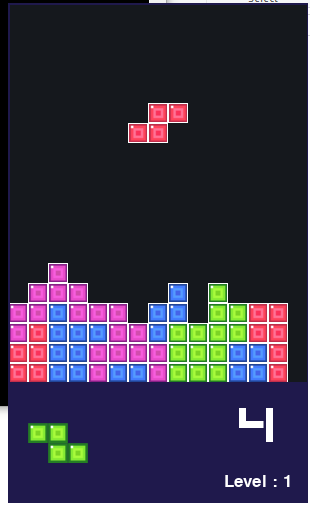

# TetrisGame 

Tetris is a simple 2D Tetris game made with python and pygame. This is built to run the game on web using webassembly.

<p align='center'>
	
</p>

## Requirements

Use the package manager [pip](https://pip.pypa.io/en/stable/) to install following packages :-
* Pygame
* Pygbag

```bash
pip install pygame
pip install pygbag
```

## Usage

1. Install certificates.command (For Mac: Applications/Python_{version})
2. python3 -m pygbag Tetris
3. The game will start running on the localhost:8000, which can be accessed using any browser
4. Initally a welcome screen, asking for player_name will appear. After entering the player_nmae press enter, and enjoy the game.

Controls:
* Use Left arrow key to move left and Right arrow key to move right.
* Use Down arrow key to fall faster.
* Use Up arrow key to rotate the figures.
* Use Space to fall at once.
* Press P to pause or unpause the game.
* Press Esc to quit the game.
* Press C to hold a piece. 
	* If no piece is held currently, the current piece is placed in hold space and new piece is genrated to repalce it.
	* If a piece is already held, the current piece and the held piece are swapped.

 ## Deployment
 * The code is deployed on S3 using statuc webhosting. 
